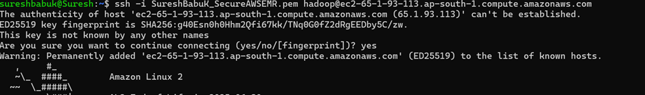

# Apace Spark - Learning
To understand the need for Spark, lets start with Hadoop.
<hr style="border: 3px solid;">

# Native Hadoop features: 
* **HDFS** (Hadoop Distributed File System): It acts as a **distributed storage layer**. 
  HDFS is great for storing large-scale data but **does not have querying capabilities**.
* **MapReduce**: A distributed data processing framework that operates over the data stored in HDFS only. 
* **YARN** (Yet Another Resource Manager): YARN as the cluster manager, allocates resources (CPU, memory) 
 to worker nodes and schedules jobs.

# Spark:
* Spark is a big data distributed processing framework like Hadoop's MapReduce, and its API provides a robust way
  to handle large-scale data efficiently, with key features listed below.
* It's built on Scala Programming language.

### Spark Key features:
* Batch/streaming data using Spark Streaming
* SQL analytics using RDD's and SparkSQL (querying distributed data)
* Machine Learning.
* Graph processing.

<hr style="border: 3px solid;">

## Spark Vs Hadoop's MapReduce: 
Although both Spark and MapReduce does data processing, the way its done is the chief difference.
* **Speed**: Spark can perform operations up to 100X faster than MapReduce because MapReduce writes most of the **data to disk**
  after each map and reduce operation; however Spark keeps most of the data **in memory** after each transformation.
  Spark will write to disk only when the memory is full.
* **Flexible Storage system**: MapReduce requires files to be stored only in HDFS, while
    Spark can work on data stored in a variety of formats like **HDFS, AWS S3, Cassandra, HBase** etc.
*  **Querying Capabilities**: Hadoop natively doesn't support querying data, hence tools such as
    **Hive, Hbase, Pig, SparkSQL**  is built on top of HDFS to provide querying features
* **SparkSql - DataFrame API** : a distributed collection of data organized into named columns, resembling a table in a relational database.
* **Real-time analytics**: Spark is effective when compared to Hadoop, because Hadoop persist to disk to store 
  intermittent result of map and reduce operations, which results in lot of I/O operations,
  hence hadoop not good for real-time and iterative processes.

* Detailed explanation on Hadoop MapReduce Vs Spark (link to integrate.io ): <a href="https://www.integrate.io/blog/apache-spark-vs-hadoop-mapreduce/">Spark Vs Hadoop</a>
<hr style="border: 3px solid;">

## Hadoop role in Spark:
* Although Hadoop plays an optional role in the Apache Spark ecosystem, it primarily used as a **resource provider(YARN)** to Spark Jobs.

## Installation & Setup:
* Step 1: Download <a href="https://spark.apache.org/downloads.html">Spark - Hadoop</a> binaries.
* Step 2: For Hadoop binaries to work in windows, Download **winutils.exe** and **hadoop.dll** files from <a href="https://github.com/cdarlint/winutils">repo.</a>
* Step 3: After downloading, place **winutils.exe** and **hadoop.dll** in **spark-3.5.3-bin-hadoop3\bin** path (from Step 1).
* For detailed installation and explanation of Spark in Java, check out <a href="https://github.com/backstreetbrogrammer/11_JavaSpark#23-download-winutilsexe-and-hadoopdll-only-for-windows">this repo</a>

## JavaSparkContext:
* It is the entry point for a Spark application.

**Key Responsibilities:**
* **Cluster Communication**: Connects with the cluster manager (YARN, Mesos, Kubernetes or Spark Standalone) to request resources for executing tasks.
* **Job Scheduling**: Breaks down a Spark application into stages and tasks, then schedules their execution across the cluster.
* **RDD Creation**: Creates RDDs from external data sources (e.g., HDFS, S3, local file systems).
Broadcast Variables and Accumulators: Manages shared variables used across nodes.

## Spark RDD:
* **RDD**(Resilient Distributed Dataset) is the fundamental data abstraction in Spark.
* It represents an **immutable** distributed collection of objects that can be processed in parallel across the cluster.
* **Fault-tolerant**: meaning they can automatically recover lost partitions due to node failures.
* **Lazy Evaluation:** Transformations on RDDs are not executed immediately. They are only computed when an action is triggered.

<hr style="border: 3px solid;">

To let Spark access **java.base/sun.nio.cha** packages, else will get unaccessible error.
```
--add-opens=java.base/sun.nio.ch=ALL-UNNAMED
```

**<a href="https://github.com/sureshkannan19/apache-spark-with-java/blob/main/src/main/java/jar/SparkJarApplication.java">Standalone mode</a>:**
```
SparkSession.builder().master("local[*]").appName("SparkBasics").getOrCreate();
```
* local --> Process the data in single thread.
* local[*] --> where * represents number of logical cores(threads) equivalent to **Runtime.getRuntime().availableProcessors()**, 
  Spark uses * option to partition the data and execute it parallel based on the number of logical cores. 
* local[k] --> where k is hardcoded thread count, local[4]

**<a href="https://github.com/sureshkannan19/apache-spark-with-java/blob/main/src/main/java/war/SparkApplication.java">Cluster mode</a>:**
```
SparkSession.builder().appName("SparkBasics").getOrCreate();
```
Spark application can be packaged only as a jar and deployed in a clustered environment such AWS EMR or standalone as desired.
```
spark-submit --master yarn --jars application.jar
```
Even though, spark is jar package, real time data processing is possible through, **spark-streaming** library
where **Kafka** can be used as a source of streaming real-time data.

**Note: With Spark jobs being executed as jars and processing real-time data, below scenarios should be handled:**
* **Logs** : If cluster manager is yarn or kubernetes, where using kubectl we can ge the logs else we need to go
  for other logging mechanism like Kibana (ELK stack)
* **Deployment** : Gracefully shutdown existing jar and (Handle checkpoints or reprocessing mechanism) in case deploying new jar.
  .option("startingOffsets", "latest") // Or "earliest" for replay -- for kafka
  .option("checkpointLocation", "/path/to/checkpoint") -- to restart from last checkpoint

<hr style="border: 3px solid;">

**Accessing External file system**:
```
clusteredSparkContext.hadoopConfiguration().set("fs.s3a.access.key", "access-key"); -- provide ur own aws s3 bucket access-key
clusteredSparkContext.hadoopConfiguration().set("fs.s3a.secret.key", "secret-key"); -- provide ur own aws s3 bucket secret-key
clusteredSparkContext.hadoopConfiguration().set("fs.s3a.endpoint", "s3.amazonaws.com");
JavaRDD<String> rdd = clusteredSparkContext.textFile("s3a://skpocb1//fake_data.txt"); -- s3a://{yourbucketname}//{filename}
```
**Steps to create s3 storage:**
1. Create aws free tier account
2. search s3, create bucket name (should be unique globally)
3. Create <a href="https://docs.aws.amazon.com/IAM/latest/UserGuide/id_users_create.html">user group</a>(link to amazon website) in aws.
4. Create <a href="https://docs.aws.amazon.com/IAM/latest/UserGuide/access-key-self-managed.html#Using_CreateAccessKey">access key</a>(link to amazon website) in aws.
5. On Step 5, access and secret key will be downloaded on your browser in csv format.

<hr style="border: 3px solid;">

**Steps to create cluster:**
1. Search EMR(ElasticMapReduce), select Spark and Hadoop version as you desire
2. Provide necessary details, such as instance count and its memory(ideally go for c4.large or m5.xlarge)
3. **Cluster termination and node replacement**: Select auto terminate on idle time and provide the timings as you desire.
4. Rest leave it as it is and create cluster
5. Now if server started successfully we should see
   
6. Connect to EC2 EMR instance from cli or putty
   **For Putty:** follow below steps
   

**For Cli**: Get cluster id from above screenshot and execute below command
```
ssh -i yoursecuritykey.pem hadoop@ec2-65-1-93-113.ap-south-1.compute.amazonaws.com
```


**Set read/write permission**: First time you'll see, **permission too open error**, you need to set permission for your .pem file,
so that only you can read or write that file.
```
chmod 600 yoursecuritykey.pem
```
After that EMR clustered is connected from CLI successfully as below


Upload your executable jar file to s3 bucket and copy that file to your EMR cluster using below cmd
```
aws s3 cp s3a://skpocb1/yourjar.jar .
```
**Note:** "." at the end indicates current working directory of the cluster.

After execute that copied jar file using below command
```
spark-submit yourjarname.jar
```


After that, you can check cli console or Spark UI,
where each instance metrics such as (time, memory, partitions) can be found.
